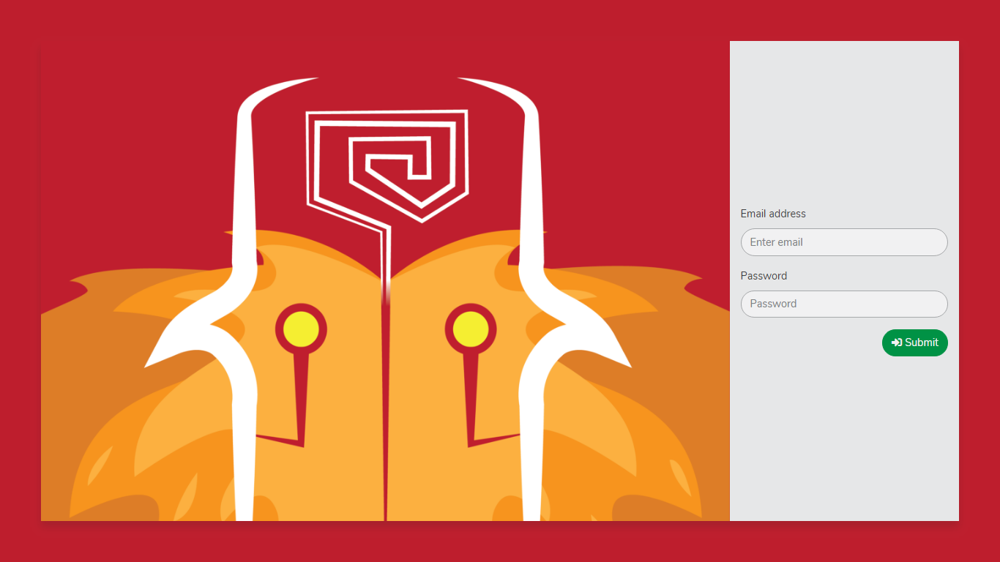

# Jugger API
###### *Create API using CRUD* | *Code-Free API creation*

[](https://github.com/jianastrero/jugger-api/issues)
[](https://github.com/jianastrero/jugger-api/commits)
[](https://github.com/jianastrero/jugger-api/issues)
[](https://github.com/jianastrero/jugger-api/blob/master/LICENSE)

***


###### screenshots




## Description
Jugger API makes creating API's the easiest way possible on laravel. It runs together with your app and can be found at http://yourdomain.com/jugger-api. It depends on Passport, dbal and VueJS. Laravel Passport for OAuth on API's, and VueJS for the web to create your API's. dbal is used for transformation / mutation. Jugger API follows [best practices for API development](https://blog.mwaysolutions.com/2014/06/05/10-best-practices-for-better-restful-api/).

## Dependencies
* laravel/passport
* doctrine/dbal

## Features
* Admin Panel for API Routes
* Integrated with Laravel Passport
* CRUD style API creation
* Handle's operations and errors using HTTP status codes
* API Versioning
* Jugger Admin Account for JuggerAPI only
* Auto-disable web interface on production
* Flexible

|              |Default|Override through request|Method|slug|
|--------------|:-----:|:----------------------:|:----:|----|
|select columns| OK | OK | GET |/api/v1/jugger-api-routes?cols=id,model_name|
|sort by column| OK | OK | GET |/api/v1/jugger-api-routes?sort=+id ***or*** <br/> /api/v1/jugger-api-routes?sort=-id|
|search or filter| OK | OK | GET |/api/v1/jugger-api-routes?q=slug:user ***or*** <br/> /jugger-api-routes?q=users ***or*** <br/> /jugger-api-routes?q=slug:user,users|
|specify items per page| OK | OK | GET |/api/v1/jugger-api-routes?items=24|

| resource slug | GET | POST | PUT | DELETE |
|---------------|-----|------|-----|--------|
| /api/v1/jugger-api-routes  | Returns a list  | Creates an item | Updates multiple items | Delete multiple items |
| /api/v1/jugger-api-route/1 | Returns an item | 404             | Updates an item        | Delete an item        |

## Features planned
* API Overview
* Code - Free Mutations Transformation

## Installation
#### 1. Require the package
`composer require jianastrero/jugger-api`
#### 2. Depending on your laravel version, you may need to add this to *config/app.php*
```php
'providers' => [
...
JianAstrero\JuggerAPI\JuggerAPIServiceProvider::class
...
]
```
#### 3. Publish Jugger API resources
`php artisan vendor:publish --tag=jugger-api`
#### 4. Setup config with db credentials
```env
DB_HOST=localhost
DB_DATABASE=homestead
DB_USERNAME=homestead
DB_PASSWORD=secret
```
#### 5. Migrate your app, passport and jugger's tables *(This is both for JuggerAPI and passport)*
`php artisan migrate`
#### 6. Seed Jugger API with its own
`php artisan jugger:seed`
#### 7. Create your jugger api admin account (default username: juggeradmin, default password: AdminPassword)
`php artisan jugger:admin` or `php artisan jugger:admin myadminuser myadminpassword`

## Passport *(for OAuth) read more on: [Laravel Passport](https://laravel.com/docs/5.7/passport)*

#### 8. Install passport
`php artisan passport:install`
#### 9. use trait HasApiToken on User model
```php
use Notifiable, HasApiTokens;
```
#### 10. Add *Passport::routes* on  AuthServiceProvider
```php
public function boot()
{
    $this->registerPolicies();

    Passport::routes();
}
```
#### 11. Set the driver for api and add Jugger API admin's guards to passport and add provider for jugger admins on *config/auth.php*
```php
'guards' => [
    'web' => [
        'driver' => 'session',
        'provider' => 'users',
    ],

    'api' => [
        'driver' => 'passport',
        'provider' => 'users',
    ],

    'juggeradmin-api' => [
        'driver' => 'passport',
        'provider' => 'juggeradmins',
    ],

    'juggeradmin' => [
        'driver' => 'session',
        'provider' => 'juggeradmins',
    ],
    ...
    'providers' => [
        'users' => [
            'driver' => 'eloquent',
            'model' => App\User::class,
        ],
        'juggeradmins' => [
            'driver' => 'eloquent',
            'model' => JianAstrero\JuggerAPI\Models\JuggerAdmin::class,
        ]
    ],
],
```

## VueJS
#### 12. Install npm packages
`npm install`
#### 13. Install npm vue session
`npm install vue-session`
#### 14. Let web pack recognize sources (*webpack.mix.js*)
```javascript
mix
    .js('resources/jianastrero/jugger-api/js/jugger-api.js', 'public/js')
    .sass('resources/jianastrero/jugger-api/sass/jugger-api.scss', 'public/css');
```
#### 15. Compile sources
`npm run dev`

## How to use
Run your web app(*php artisan serve*) then open your favorite web browser and navigate to http://127.0.0.1:8000/jugger-api
From here, you could use any user you already have to login. If you dont have a user, better create one. *On Future changes JuggerAPI will have its own login account such that it wont interfere with your app*. Remember that as of now, it is required to use email and password to get authenticated and be logged in.

Once logged in, you could then create new routes, edit, or delete. Also, be careful to delete the record for JuggerAPI because it will refrain you from creating, modifying, or deleting new records. To fix this, run `php artisan jugger:seed` again.

## To make a model be recognized by JuggerAPI, your model should use the traits HasTable and CanMutate
```php
use Notifiable, HasApiTokens, HasTable, CanMutate;
```
When this is done, just refresh your page and this model will be available on add and edit modal selection.

## To allow add and edit on a model, you need to define fillables
```php
protected $fillable = [
    'name', 'email', 'password',
];
```

## For automatic mutation, Jugger API utilizes the casts array of models to transform columns
```php
protected $casts = [
    'array_column' => 'array'
];
```

#### *NOTE: JUGGER API IS AUTOMATICALLY DISABLED ON PRODUCTION MODE(DEBUG OFF / FALSE). THIS IS TO PREVENT API'S FROM BEING ALTERED ON PRODUCTION*

## License
This software is released under the [MIT license](https://opensource.org/licenses/MIT).
