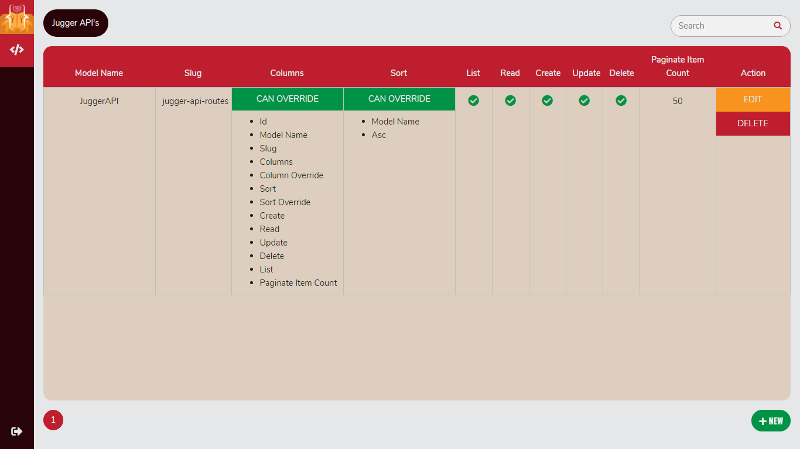

# Jugger API


###### screenshots




## Description
Jugger API makes creating API's the easiest way possible on laravel. It runs together with your app and can be found at http://yourdomain.com/jugger-api. It depends on Passport, dbal and VueJS. Laravel Passport for OAuth on API's, and VueJS for the web to create your API's. dbal is used for transformation / mutation. Jugger API follows [best practices for API development](https://blog.mwaysolutions.com/2014/06/05/10-best-practices-for-better-restful-api/).

## Installation
#### 1. Require the package
`composer require jianastrero/jugger-api`
#### 2. Require laravel passport
`composer require laravel/passport`
#### 3. Require doctrine dbal
`composer require doctrine/dbal`
#### 4. Migrate your app, passport and jugger's tables
`php artisan migrate`
#### 5. Setup config with db credentials
```env
DB_HOST=localhost
DB_DATABASE=homestead
DB_USERNAME=homestead
DB_PASSWORD=secret
```
#### 6. Install passport
`php artisan passport:install`
#### 7. Publish Jugger API resources
`php artisan vendor:publish --tag=jugger-api`
#### 8. Seed Jugger API with its own
`php artisan jugger:seed`
#### 9. Install npm packages
`npm install`
#### 10. Install npm vue session
`npm install vue-session`
#### 11. Let web pack recognize sources (*webpack.mix.js*)
```javascript
mix
    .js('resources/jianastrero/jugger-api/js/jugger-api.js', 'public/js')
    .sass('resources/jianastrero/jugger-api/sass/jugger-api.scss', 'public/css');
```
#### 12. Compile sources
`npm run dev`
#### 13. Depending on your  laravel version, you may need to add this to config/app.php
```php
JianAstrero\JuggerAPI\JuggerAPIServiceProvider::class
```
#### 14. use trait HasApiToken on User model
```php
use Notifiable, HasApiTokens;
```

## How to use
Run your web app(*php artisan serve*) then open your favorite web browser and navigate to http://127.0.0.1:8000/jugger-api
From here, you could use any user you have created to login. Remember that as of now, it is required to use email and password to get authenticated and be logged in.

Once logged in, you could then create new routes, edit, or delete. Also, be careful to delete the record for JuggerAPI because it will refrain you from creating, modifying, or deleting new records.

## To add a model to your route, your model should use the traits HasTable and CanMutate
```php
use Notifiable, HasApiTokens, HasTable, CanMutate;
```
When this is done, just refresh your page and this model will be available on add and edit modal selection,


## License
This software is released under the [MIT license](https://opensource.org/licenses/MIT).
